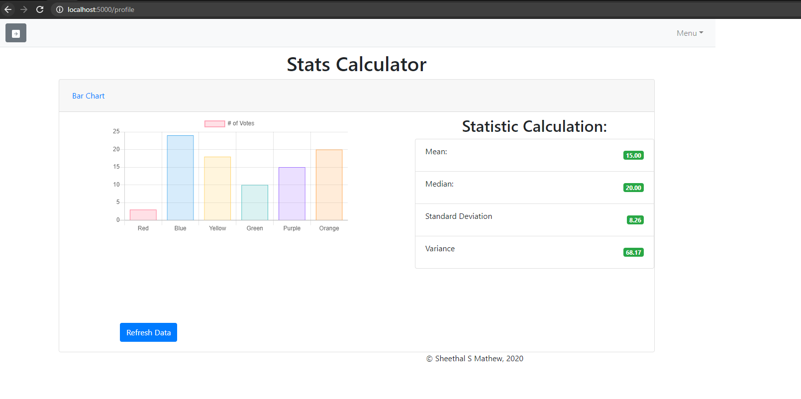
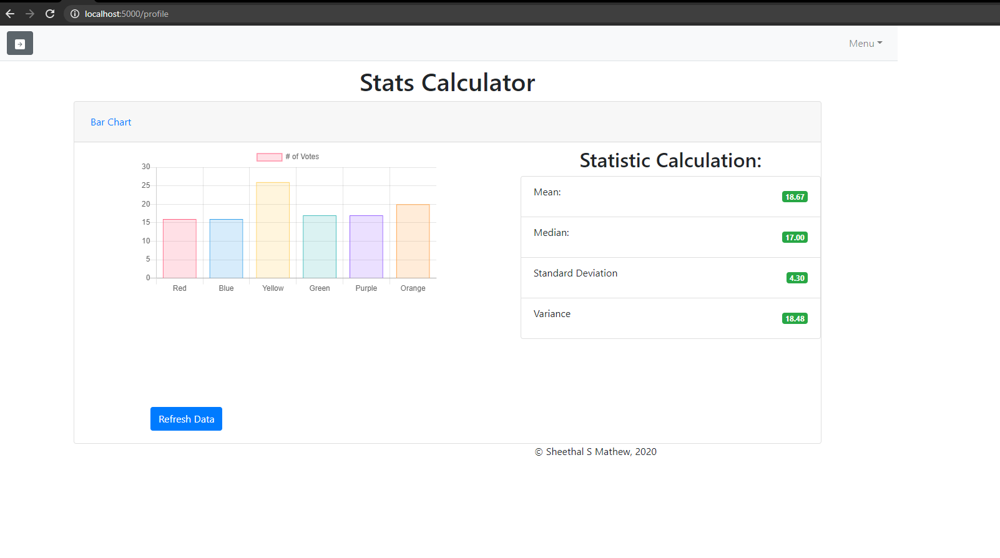
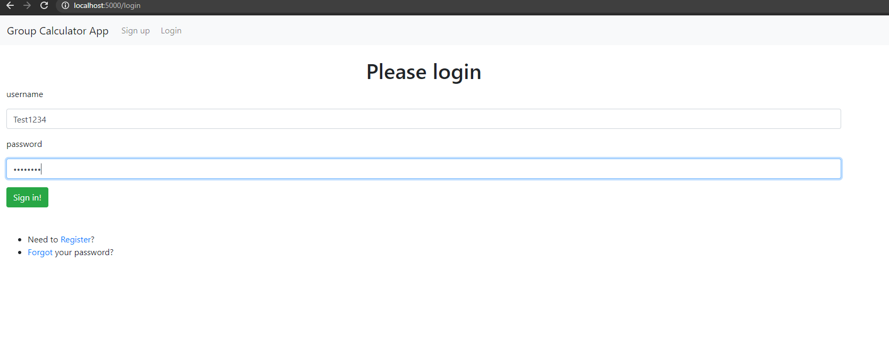

# Group Statistic Project

This project allows the user to post data and calculate statistical values. 
User has the ability to create an account, log in, verify account, and generate datasets.
Random datasets are used to calculate, Mean, Median, StandardDev, and Variance

## Steps to follow
1. Go to https://github.com/ssm29njit/JedidiahSheethalFinalWebApp601.git and download
2. Open in pycharm. Add the SENDGRID_API_KEY provided in comments section of canvas to the init.py under mail folder
3. Run docker-compose up

## Screenshot 

## TeamMembers 
Sheethal Mathew
Jedidiah John
